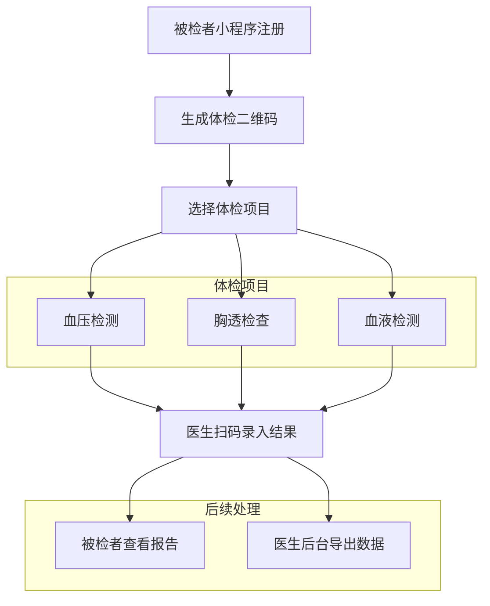
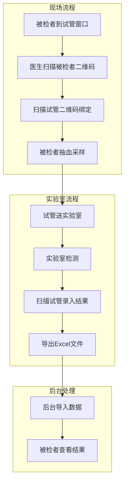

# 惠民体检小程序用例说明书

| 版本号 | 日期        | 作者 |
| ------ | ----------- | ---- |
| v2.0   | 08-17 08:24 | xxx  |

## 项目概述

xx体检小程序是为龙旗科技园项目设计的体检管理系统，主要用于管理工人体检流程，提高体检效率和准确性。系统包含管理后台和两个小程序（被检者小程序和医生小程序）。

## 系统角色

### 1. 系统管理员
- 负责管理医生账户
- 管理体检流程和配置
- 生成医生认证口令
- 管理试管编码生成规则

### 2. 医生/护士
- 负责各项体检项目的检测和数据录入
- 使用医生小程序进行操作
- 通过5位随机口令认证身份
- 进行诊断编辑和报告生成

### 3. 被检者（工人）
- 通过小程序进行注册登记
- 查看体检报告
- 展示体检二维码

## 体检项目

### 1. 血压检测
- **检测内容**：舒张压、收缩压、心率
- **检测方式**：使用血压仪测量
- **数据录入**：三个数值在对应栏目输入

### 2. 胸透检查
- **检测内容**：胸部X光片
- **检测结果**：未见异常/异常（二选一）
- **检测方式**：专用胸透车

### 3. 血液检测
- **检测内容**：
  - 血常规（白细胞计数、红细胞计数、血红蛋白浓度等）
  - 肝功能（谷丙转氨酶ALT、谷草转氨酶AST）
  - 血小板相关指标
- **检测项目详细列表**：
  | 代码 | 项目名称 | 检测意义 |
  |------|----------|----------|
  | WBC | 白细胞计数 | 免疫系统功能指标 |
  | RBC | 红细胞计数 | 贫血相关指标 |
  | Hb | 血红蛋白浓度 | 氧气运输能力 |
  | PLT | 血小板计数 | 凝血功能指标 |
  | ALT | 谷丙转氨酶 | 肝功能指标 |
  | AST | 谷草转氨酶 | 肝功能指标 |
  | Hct | 红细胞比容 | 血液浓度指标 |
  | MCV | 平均红细胞体积 | 红细胞大小指标 |
  | MCH | 平均红细胞血红蛋白含量 | 红细胞含铁量 |
  | MCHC | 平均红细胞血红蛋白浓度 | 红细胞色素浓度 |
- **检测流程**：
  1. 被检者到试管领取窗口
  2. 医生扫描被检者二维码
  3. 扫描试管二维码建立绑定（试管编码以'H'为前缀）
  4. 被检者抽血采样
  5. 试管送至实验室检测
  6. 实验室检测设备导出Excel文件
  7. 后台管理系统导入Excel数据
  8. 系统根据试管编码绑定被检者
- **特殊处理**：
  - **谷丙谷草检测**：一个样本会产生两条记录（谷丙转氨酶和谷草转氨酶），系统需要合并处理并计算谷草/谷丙比值
  - **试管编码规则**：以'H'为前缀，后续数字递增，用于区分不同体检机构
  - **数据绑定**：通过试管编码与被检者建立关联关系

## 功能用例

### 1. 管理员功能

#### 1.1 医生管理
- **新增医生**：添加新的医生/护士账户
- **删除医生**：移除医生账户
- **修改医生信息**：更新医生基本信息

### 2. 被检者小程序功能

#### 2.1 注册登记
- **功能描述**：被检者通过小程序进行注册
- **输入信息**：
  - 姓名
  - 年龄
  - 性别
  - 身份证号码
  - 手机号码
  - 入职公司名称
- **数据验证**：对输入信息进行格式和有效性验证

#### 2.2 生成体检码
- **功能描述**：注册成功后生成个人身份二维码
- **用途**：用于医生扫码识别身份
- **数据覆盖**：同一身份证号重复注册时，数据会覆盖更新

#### 2.3 查看体检报告
- **功能描述**：被检者查看自己的体检结果
- **操作方式**：通过刷新按钮获取最新报告
- **报告数据结构**：
  - **基本信息**：姓名、性别、年龄、条码、手机号码、证件号码、入职单位
  - **检查项目**：
    - 胸透：结果描述（如"心肺膈未见明显异常"）
    - 血压：收缩压/舒张压（如"124/86mmHg"）
    - 心率：次/分（如"84次/分"）
  - **检验项目表格**：
    | 项目代码 | 项目名称 | 检测结果 | 异常提示 | 单位 | 参考范围 |
    |----------|----------|----------|----------|------|----------|
    | AST | 谷草转氨酶测定 | 21.80 |  | U/L | ≤40 |
    | ALT | 谷丙转氨酶测定 | 9.87 |  | U/L | 7~40 |
    | PLT | 血小板计数 | 413.00 | ↑ | 10^9/L | 125~350 |
  - **综合意见**：总体健康状况描述
  - **报告日期**：体检完成日期
- **异常指标标识**：
  - ↑：高于参考范围上限
  - ↓：低于参考范围下限
  - 空白：在正常范围内

### 3. 医生小程序功能

#### 3.1 扫码识别被检者
- **功能描述**：扫描被检者二维码获取身份信息
- **操作流程**：
  1. 点击扫描按钮
  2. 扫描被检者体检码
  3. 显示被检者信息

#### 3.2 血压数据录入
- **功能描述**：录入血压检测结果
- **输入格式**：支持两种格式
  - 逗号分隔格式：舒张压,收缩压,心率
  - 分开输入：三个独立输入框
- **提交方式**：确认后提交保存
- **数据编辑**：后台诊断时可编辑血压数值

#### 3.3 胸透结果录入
- **功能描述**：录入胸透检查结果
- **输入选项**：未见异常/异常（单选）
- **提交方式**：确认后提交保存

#### 3.4 血液试管绑定
- **功能描述**：将被检者与试管进行绑定
- **操作流程**：
  1. 扫描被检者二维码
  2. 扫描试管二维码
  3. 建立绑定关系

### 4. 医生认证流程

#### 4.1 医生账户管理
- **账户创建**：管理员在后台创建医生账户
- **信息录入**：医生姓名、手机号码、所属科室
- **口令生成**：系统自动生成5位随机认证口令
- **口令分发**：管理员将口令发送给对应医生

#### 4.2 医生登录认证
- **扫码登录**：医生扫描医生小程序码
- **口令输入**：输入管理员分配的5位口令
- **身份验证**：系统验证口令与医生账户匹配
- **OpenID绑定**：验证成功后绑定微信OpenID与医生账户
- **后续登录**：已绑定的医生可直接扫码登录

### 5. 医生后台管理功能

#### 5.1 血液分析数据导入
- **功能描述**：导入实验室血液分析结果

- **数据来源**：Excel文件导出

- **处理方式**：批量导入并关联到对应被检者

- **导入分类**：
  
  - **血常规导入**：导入血常规检测数据
  - **谷丙谷草导入**：导入肝功能检测数据
  
- **数据处理**：
  
  - 血常规数据：直接导入，一对一关联
  
    
  
  - 谷丙谷草数据：两条记录合并为一条，计算谷草/谷丙比值
  
  - 
  
- **试管编码规则**：以'H'为前缀，数字递增，避免与其他体检机构混淆

  

#### 5.2 批量导出被检者数据
- **功能描述**：按日期和时间段批量导出被检者汇总数据
- **导出格式**：CSV格式文件
- **报告类型**：
  - **个人PDF报告**：每个被检者的详细体检报告，连续生成便于打印
  - **汇总Excel报告**：仅包含基本信息和各项检查结论（正常/异常）
- **报告用途**：
  - **PDF报告**：纸质存档，提交给人社局档案库
  - **Excel报告**：提交给工厂人力资源部，用于工人招聘审核
- **导出特点**：
  - 支持按日期筛选
  - PDF报告连续生成，便于批量打印
  - 每份报告需要盖章
  - 支持单个报告补充打印
- **操作流程**：
  1. 管理员登录后台管理系统
  2. 进入数据导出功能模块
  3. 选择导出时间范围（开始日期和结束日期）
  4. 点击导出按钮生成CSV文件
  5. 系统自动下载或提供文件下载链接
- **导出数据内容**：
  - 被检者基本信息（姓名、性别、年龄、手机号、证件号、入职单位）
  - 体检项目结果（胸透、血压、心率）
  - 血液检验结果（各项指标数值和参考范围）
  - 综合意见和体检日期
- **文件用途**：
  - 方便使用WPS或Excel进行数据查看和分析
  - 支持数据传递给其他部门或相关方
  - 便于数据备份和归档
- **数据格式说明**：
  - 使用UTF-8编码确保中文正常显示
  - 包含表头便于数据识别
  - 异常指标使用特殊标记（↑/↓）便于筛选

#### 5.3 诊断工作流程
- **功能描述**：医生对导入的检测数据进行诊断和编辑
- **操作流程**：
  1. 按日期查询被检者数据
  2. 进入诊断编辑状态
  3. 对每个被检者进行诊断
  4. 编辑检测数值和诊断结论
  5. 保存诊断结果
- **诊断内容**：
  - **血压诊断**：编辑舒张压、收缩压、心率数值，选择正常/异常结论
  - **胸透诊断**：确认未见异常/异常结论（数值不可编辑）
  - **血常规诊断**：编辑血常规指标数值，选择正常/异常结论
  - **谷丙谷草诊断**：编辑谷丙、谷草、谷草/谷丙比值，选择正常/异常结论
- **诊断特点**：
  - 医生可手动编辑所有检测数值
  - 考虑临界值情况，医生可判断接近标准值的为正常
  - 支持批量诊断操作
  - 以日期为单位进行批量处理

## 业务流程

### 1. 体检总流程

**流程步骤：**
1. 被检者通过小程序注册登记
2. 生成个人体检二维码
3. 根据现场情况选择体检项目（无固定顺序）
4. 医生扫码录入检测结果
5. 被检者查看体检报告
6. 医生管理后台导出时间段内数据汇总表格

**流程图：**

### 2. 血液检测专项流程

**流程步骤：**
1. 被检者到试管领取窗口
2. 医生扫描被检者二维码
3. 扫描试管二维码建立绑定
4. 被检者到抽血处进行采样
5. 试管送至实验室检测
6. 实验室医生扫描试管二维码
7. 录入检测结果到分析软件
8. 导出Excel文件
9. 后台导入Excel数据
10. 被检者查看结果

**流程图：**

## 系统特性

### 1. 高效性
- 简化操作流程，减少点击步骤
- 支持并行检测，提高处理效率
- 数据录入采用快捷方式（如逗号分隔）

### 2. 灵活性
- 医生可动态调配到不同检测岗位
- 被检者可自主选择检测顺序
- 支持数据覆盖更新（重复体检）

### 3. 实用性
- 界面简洁，操作直观
- 专注于核心功能，避免复杂设计
- 适应工厂快速体检场景需求

## 技术要点

### 1. 二维码管理
- 每个被检者生成唯一身份二维码
- 试管使用编码标识，以'H'为前缀，数字递增
- 支持试管与被检者的批量绑定关系

### 2. 数据处理
- 支持批量数据导入导出
- 实时数据同步和更新
- 数据验证和错误处理
- 特殊数据处理：谷丙谷草两条记录合并计算

### 3. 系统集成
- 多端协同（Web后台 + 双小程序）
- 离线数据采集和同步
- 与外部检测软件的数据交换
- WeChat OpenID用户识别机制

### 4. 数据库设计
- 使用身份证号作为被检者主键
- 支持数据覆盖更新
- 试管编码唯一性管理
- 检测数据历史记录

### 5. 认证与安全
- 医生使用5位随机口令认证
- 管理员固定账户管理
- 医生OpenID与系统账户绑定
- 敏感医疗数据保护

### 6. 报告生成
- PDF批量生成技术
- Excel数据导出
- 报告模板管理
- 批量打印优化

## 注意事项

1. **支付功能**：本版本不包含在线支付功能，使用现有收款码方式
2. **权限管理**：医生拥有全部检测权限，不做细粒度权限控制
3. **数据覆盖**：重复体检数据采用覆盖方式处理，以身份证号为唯一标识
4. **实验室对接**：不直接与检测设备对接，采用Excel导入方式
5. **诊断标准**：不使用程序自动判断，由医生根据临界值情况手动诊断
6. **试管编码**：使用'H'前缀区分不同体检机构，避免试管混淆
7. **报告合规**：生成的PDF报告需要盖章存档，提交给人社局
8. **数据安全**：处理敏感医疗数据，需要确保数据安全和隐私保护
9. **批量操作**：支持按日期批量诊断和报告生成，提高工作效率
10. **用户认证**：医生通过5位随机口令认证，避免使用手机号等敏感信息